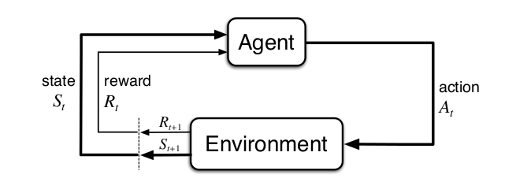
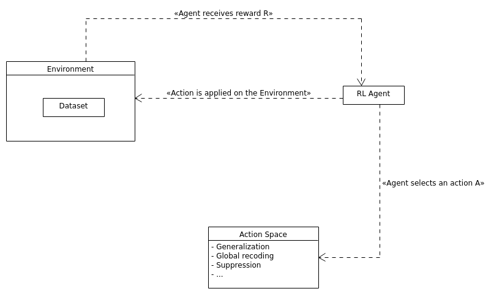
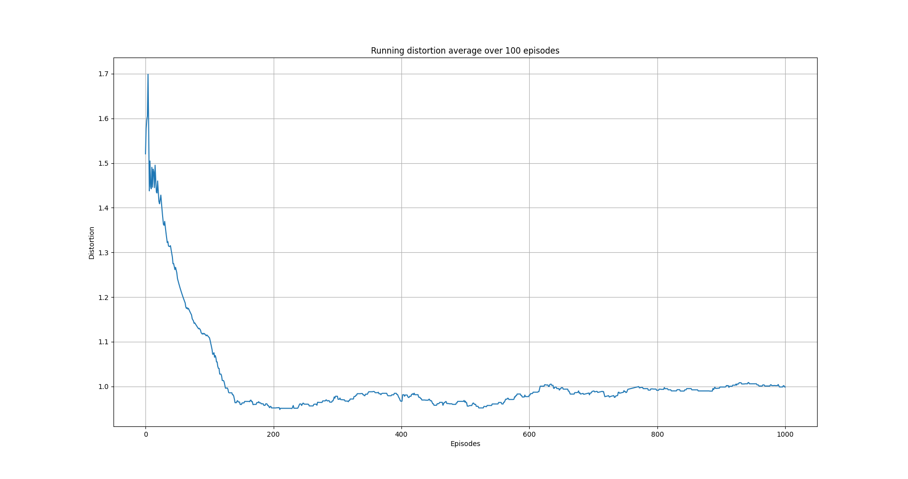
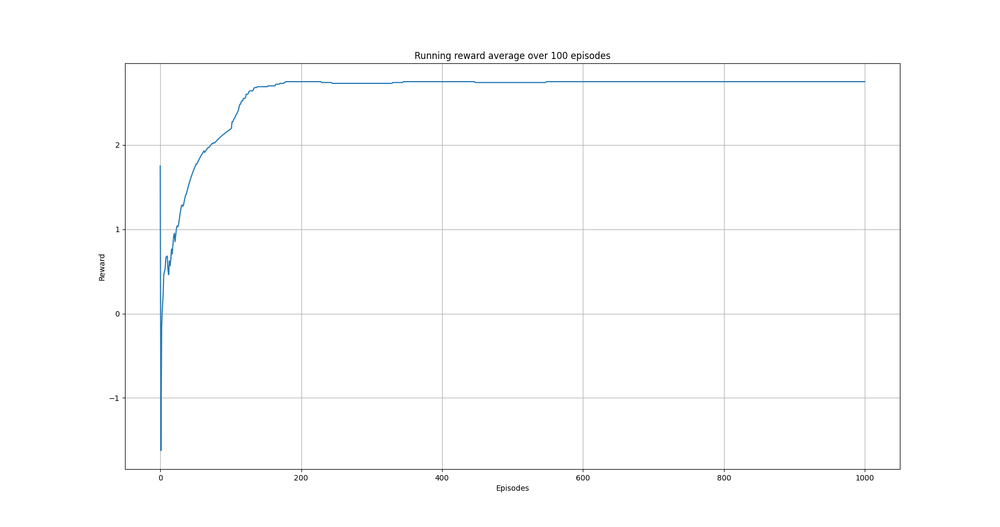
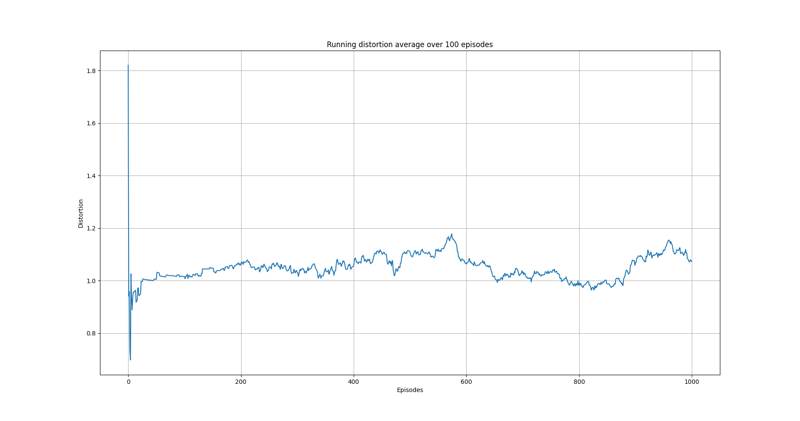
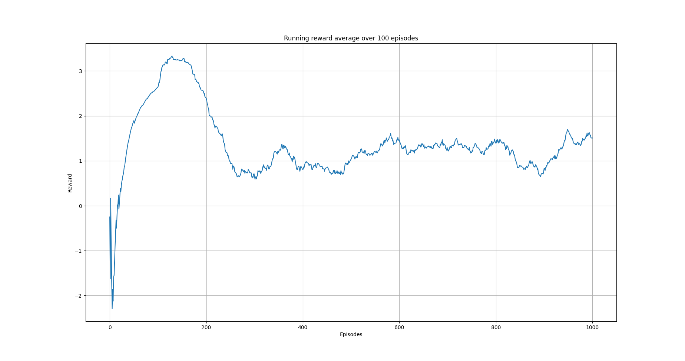

# RL anonymity (with Python)

An experimental effort to use reinforcement learning techniques for data anonymization. 

## Conceptual overview

The term data anonymization refers to techiniques that can be applied on a given dataset, D, such that after
the latter has been submitted to such techniques, it makes it difficult for a third party to identify or infer the existence
of specific individuals in D. Anonymization techniques, typically result into some sort of distortion
of the original dataset. This means that in order to maintain some utility of the transformed dataset, the transofrmations
applied should be constrained in some sense. In the end, it can be argued, that data anonymization is an optimization problem
meaning striking the right balance between data utility and privacy. 

Reinforcement learning is a learning framework based on accumulated experience. In this paradigm, an agent is learning by iteracting with an environment 
without (to a large extent) any supervision. The following image describes, schematically, the reinforcement learning framework .

 

The agent chooses an action, ```a_t```, to perform out of predefined set of actions ```A```. The chosen action is executed by the environment
instance and returns to the agent a reward signal, ```r_t```, as well as the new state, ```s_t```, that the enviroment is in. 
The framework has successfully been used  to many recent advances in control, robotics, games and elsewhere.


Let's assume that we have in our disposal two numbers a minimum distortion, ```MIN_DIST``` that should be applied to the dataset
for achieving privacy and a maximum distortion, ```MAX_DIST```,  that should be applied to the dataset in order to maintain some utility.
Let's assume also that any overall dataset distortion in ```[MIN_DIST, MAX_DIST]``` is acceptable in order to cast the dataset as 
preserving  privacy and preserving dataset utility. We can then train a reinforcement learning agent to distort the dataset
such that the aforementioned objective is achieved.

Overall, this is shown in the image below.



The images below show the overall running distortion average and running reward average achieved by using the 
<a href="https://en.wikipedia.org/wiki/Q-learning">Q-learning</a> algorithm and various policies.

**Q-learning with epsilon-greedy policy and constant epsilon**



**Q-learning with epsilon-greedy policy and decaying epsilon per episode**




**Q-learning with epsilon-greedy policy with decaying epsilon at constant rate**


**Q-learning with softmax policy running average distorion**




## Dependencies 

The following packages are required. 

- NumPy
- <a href="https://www.sphinx-doc.org/en/master/">Sphinx</a> 
- <a href="#">Python Pandas</a>

You can use 

```
pip install -r requirements.txt
```

## Examples

- <a href="src/examples/qlearning_three_columns.py"> Qlearning agent on a three columns dataset</a>
- <a href="src/examples/nstep_semi_grad_sarsa_three_columns.py"> n-step semi-gradient SARSA on  a three columns dataset</a>

## Documentation

You will need <a href="https://www.sphinx-doc.org/en/master/">Sphinx</a> in order to generate the API documentation. Assuming that Sphinx is already installed
on your machine execute the following commands (see also <a href="https://www.sphinx-doc.org/en/master/tutorial/index.html">Sphinx tutorial</a>). 

```
sphinx-quickstart docs
sphinx-build -b html docs/source/ docs/build/html
```

## References

